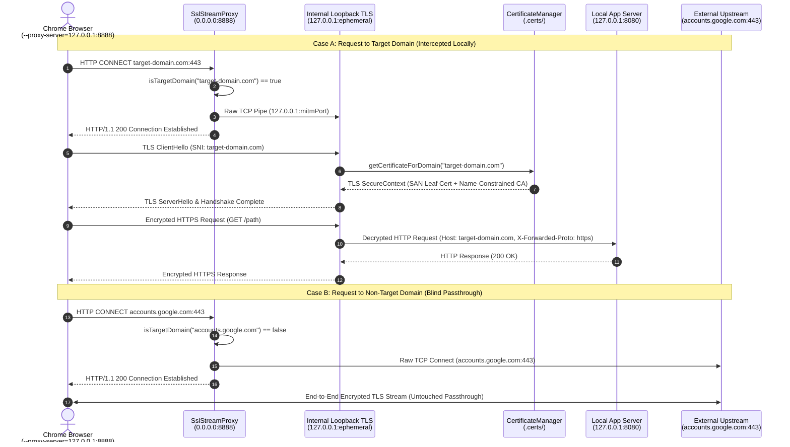

# Portable Local SSL Forward Proxy (`lib/ssl-proxy`)

A self-contained, zero-dependency Node.js forward HTTP/HTTPS proxy and X.509 certificate manager designed for local development against strict production origins.

---

## 1. Overview & Portability

Client-side integrations such as Google Sign-In OAuth and Subscribe with Google (`swg.js`) enforce strict JavaScript origin verification (`window.location.origin`). When testing against production OAuth clients or publisher configurations where adding `localhost` origins is not permitted, your local development server must be accessed via an authorized production origin (e.g., `https://your-production-domain.com`).

This folder (`lib/ssl-proxy/`) is designed to be **fully portable and framework-agnostic**:
- **Zero external npm dependencies**: Uses only built-in Node.js modules (`node:crypto`, `node:fs`, `node:http`, `node:https`, `node:net`, `node:tls`) and the `openssl` CLI.
- **Drop-in portability**: Publishers can copy the entire `lib/ssl-proxy/` folder into any Node.js, Express, Next.js, or custom backend project to intercept their own production domain locally.
- **Scoped Security**: Automatically generates a local Root CA restricted with X.509 `nameConstraints` (`permitted;DNS:<target-domain>`) so the generated CA cannot be used to spoof unrelated domains.

### Directory Structure
```text
lib/ssl-proxy/
├── README.md                     # Standalone documentation & architecture guide
├── certs.js                      # CertificateManager: Root CA & dynamic SNI leaf cert generator
├── ssl-stream-proxy.js           # SslStreamProxy: Forward proxy & selective TLS termination server
└── templates/
    ├── openssl-ca.cnf            # OpenSSL config template for the Name-Constrained Root CA
    └── openssl-leaf.ext          # OpenSSL v3 extension template for SAN leaf certificates
```

---

## 2. Architecture & Data Flow

The proxy listens on port `8888` and inspects incoming HTTP `CONNECT` requests from the browser:
1. **Target Domains** (e.g. `reader-revenue-demo.ue.r.appspot.com:443`): Intercepted and routed to an internal loopback HTTPS server (`127.0.0.1:<ephemeral_port>`). TLS is dynamically terminated using an on-demand Subject Alternative Name (SAN) certificate minted by `CertificateManager`, and the decrypted HTTP request is forwarded to your local application server (`127.0.0.1:8080`) with `X-Forwarded-Proto: https`.
2. **All Other Domains** (e.g. `accounts.google.com`, `googleapis.com`, CDNs): Blind-tunneled via raw TCP (`net.connect`) directly to the upstream destination without TLS inspection or modification.



---

## 3. Standalone Setup & Integration

### A. Environment Variables
You can configure the proxy via environment variables (or `.env`):

| Variable | Default | Description |
| :--- | :--- | :--- |
| `SSL_PROXY_ENABLED` | `false` | Set to `true` to enable and start the proxy server. |
| `SSL_PROXY_PORT` | `8888` | Port on which the forward HTTP/HTTPS proxy listens. |
| `SSL_TARGET_DOMAIN` | `reader-revenue-demo.ue.r.appspot.com` | Comma-separated list of domains to intercept and route locally. |
| `SSL_CERTS_DIR` | `.certs` | Directory where the Root CA and leaf certificates are stored. |
| `PORT` | `8080` | Local application HTTP port to forward decrypted requests to. |

### B. Programmatic Integration (Express / Node HTTP)
To embed the proxy into your own application:

```javascript
import express from 'express';
import {SslStreamProxy} from './lib/ssl-proxy/ssl-stream-proxy.js';

const app = express();
app.set('trust proxy', 'loopback');

// Start the forward SSL proxy when enabled
if (process.env.SSL_PROXY_ENABLED === 'true') {
  const proxy = new SslStreamProxy({
    targetDomains: ['your-publisher-domain.com'],
    port: 8888,
  });
  proxy.start();
}

app.listen(8080, () => {
  console.log('Local server listening on port 8080');
});
```

---

## 4. Running Instructions & Launching Chrome

To test your local server through the production URL without modifying your operating system's certificate keychain, launch Google Chrome with `--proxy-server` and `--ignore-certificate-errors`.

### Linux
```shell
google-chrome \
  --proxy-server="http://127.0.0.1:8888" \
  --ignore-certificate-errors \
  https://your-publisher-domain.com/
```

### macOS
```shell
/Applications/Google\ Chrome.app/Contents/MacOS/Google\ Chrome \
  --proxy-server="http://127.0.0.1:8888" \
  --ignore-certificate-errors \
  https://your-publisher-domain.com/
```

### Launching Chrome: Default Profile vs. Blank Profile (`--user-data-dir`)

When launching Chrome from the command line, how Chrome handles `--proxy-server` and `--ignore-certificate-errors` depends on whether Chrome is already running:

1. **Launching WITHOUT `--user-data-dir` (Using your existing Chrome profile)**:
   - You **must completely quit all running Chrome windows** before executing the command.
   - **Why?** If any Chrome process using your default profile is already running, executing `google-chrome` from the terminal will simply send a message to the existing process to open a new tab and **silently ignore command-line flags like `--proxy-server` and `--ignore-certificate-errors`**.
2. **Launching WITH `--user-data-dir` (Running a blank/isolated profile in parallel)**:
   - If you want to keep your main Chrome browser open and run a proxied test instance in parallel, pass `--user-data-dir` pointing to a temporary directory:
     ```shell
     google-chrome \
       --user-data-dir="/tmp/chrome-dev-proxy" \
       --proxy-server="http://127.0.0.1:8888" \
       --ignore-certificate-errors \
       https://your-publisher-domain.com/
     ```
   - Chrome will immediately spawn an independent browser process with a fresh profile where `--proxy-server` and `--ignore-certificate-errors` are guaranteed to take effect without affecting your main browsing session.

---

## 5. Utility Endpoints

While the proxy is running on port `8888`, it exposes three direct HTTP utility endpoints:

- **Health Check (`GET http://127.0.0.1:8888/health`)**:
  Returns a JSON status payload showing active proxy configuration:
  ```json
  {
    "status": "ok",
    "proxyPort": 8888,
    "targetDomains": ["your-publisher-domain.com"],
    "appPort": 8080
  }
  ```
- **Root CA Certificate (`GET http://127.0.0.1:8888/ca.crt`)**:
  Downloads the PEM-encoded Root CA certificate (`application/x-x509-ca-cert`) if you prefer to import the certificate into your OS/browser trust store instead of using `--ignore-certificate-errors`.
- **Proxy Auto-Config (`GET http://127.0.0.1:8888/proxy.pac`)**:
  Serves a dynamic PAC file that routes only `targetDomains` through `PROXY 127.0.0.1:8888` and sends all other traffic `DIRECT`.
